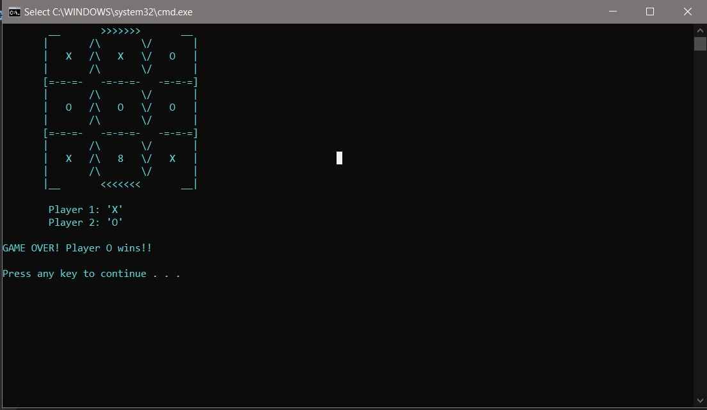
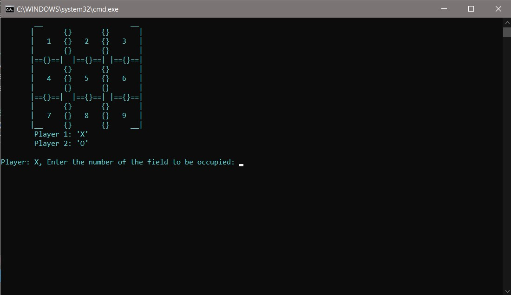
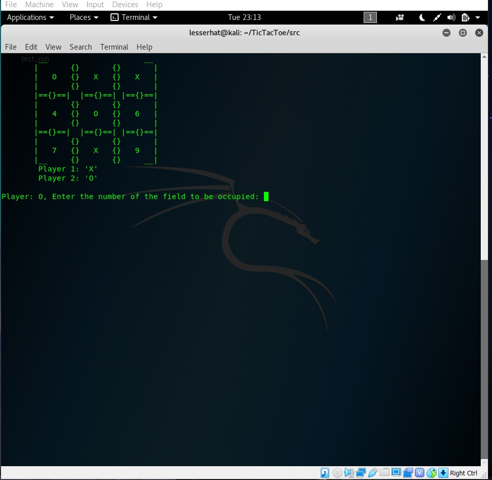

# TIC_TAC_TOE

I bring you Tripple T... made with custom game board designs you can choose from...enjoy:)

Oh and I added a splash screen because why not XD

## INFO
- This program uses file-handling, the original game board is copied into a temporary text file which is modified as you play
and deleted when the game is over.
- The numbers on the board serve as placeholders and their locations are extracted and saved to memory to be used when the user points to
that location.

## SCREENSHOTS

## UPDATE LOG
- v10.08.2020 introduced AI to play against (extremely easy AI) and  players can play multiple games with different boards before exiting.
- v10.07.2020 restructured into OO(Got rid of C-style stuff), and got rid of extra files 
- Made compatible with linux, you should have a clean build, even running raw from terminal

## LINUX
