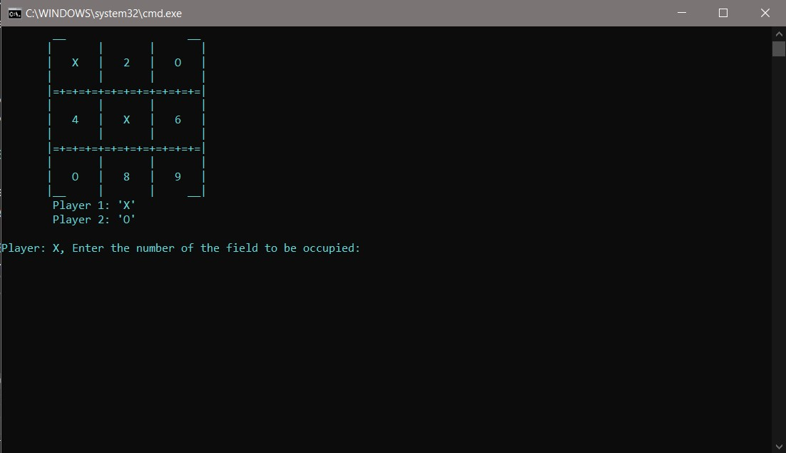
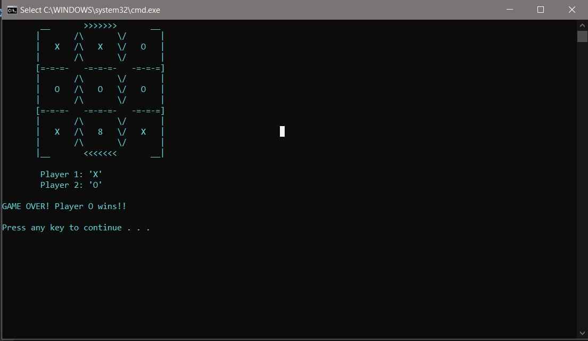
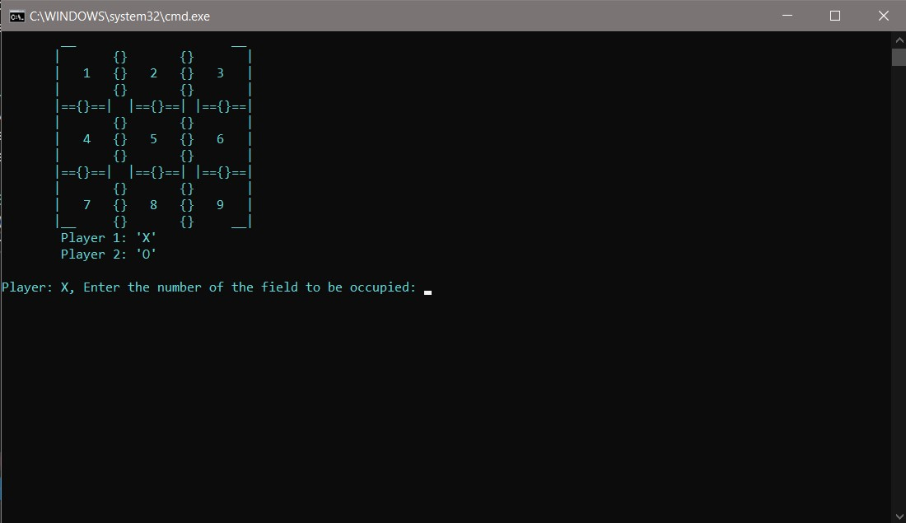

# TIC_TAC_FREAKING_TOE

I bring you Tripple T... made with custom game board designs you can choose from...enjoy:)

Oh and I added a splash screen to make it cooler XD

## INFO
- This program uses file handling, the original game board is copied into a temporary text file which is modified as you play
and deleted when the game is over.
- The numbers serve as placeholders and their locations are extracted and saved to memory to be used when the user points to
that location.

## SCREENSHOTS

## POSSIBLE UPDATES
- Replace windows specific commands with general commands that can run cross-platform
- Let players play multiple times without exiting(and add win ratio and stuff)
- Allow user to play against "bot"
- Create a level system 

## UPDATE LOG
- Linux users wont have to worry about system() commands(added conditional compilation to know which system() command
to run based on platform)